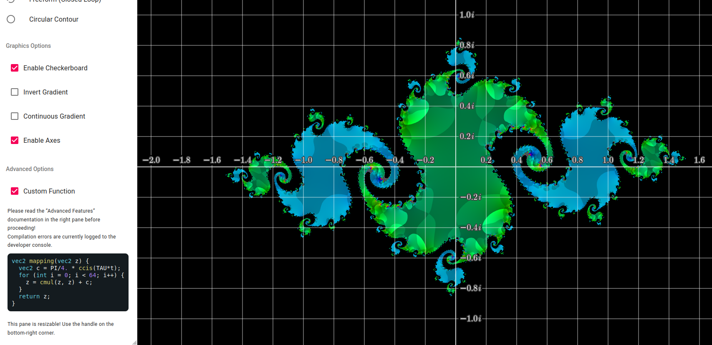
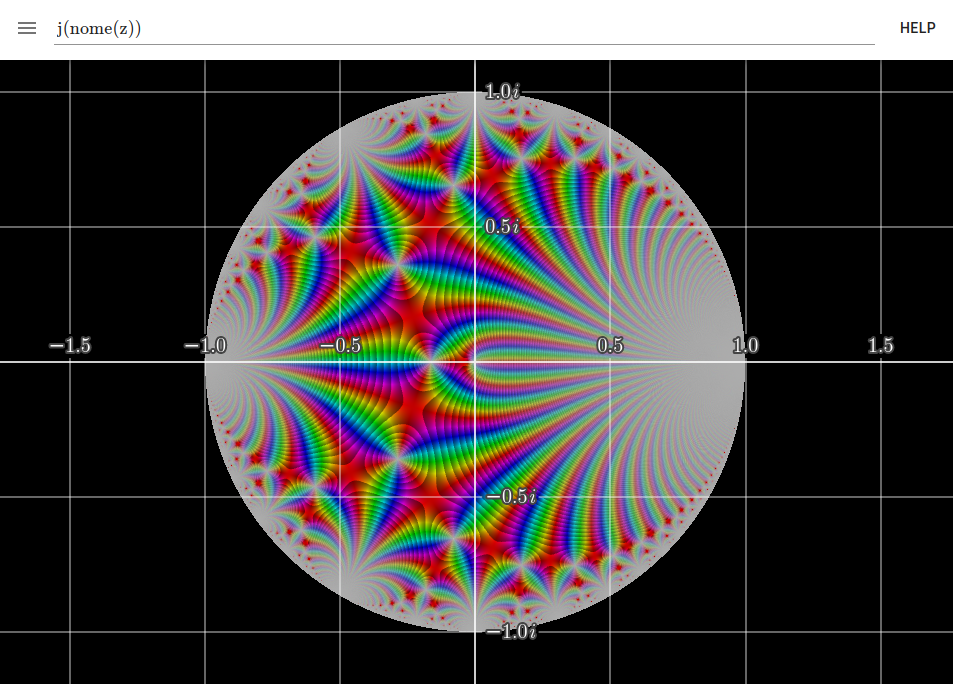

# Complex Function Plotter 
A fully-featured, responsive [domain-coloring plotter](https://samuelj.li/complex-function-plotter) for complex-analytic functions.

## Features
* Beautiful, fast, interactive domain-coloring plots of complex functions
* Computation of arbitrary contour integrals and residues
* Arbitrary number of auxiliary variables; fast + smooth visualization of their effect on the plotted function
* Arbitrary custom functions via GLSL shader API
* Several toggleable display and graphics options
* Fully anti-aliased and anti-Moiré'd visual output

## Documentation
Full documentation is available within the app.
Click the ‘Help’ button in the upper right to open.
